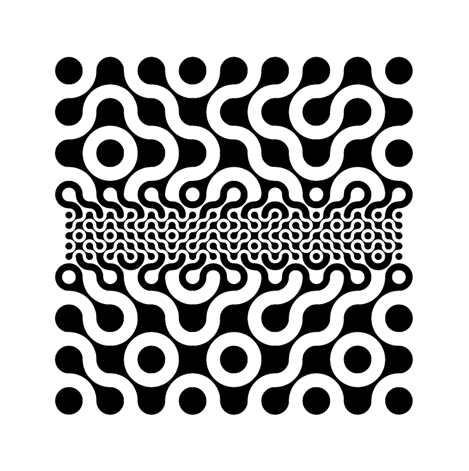

# Multiscale Truchet Patterns

This is an implementation of multiscale Truchet patterns in Processing.

## These are the keys/mouse controls:

 - 'r' - toggle show tiling
 - 'i' - (lowercase I) invert colours
 - space - reinitialise
 - Left-click: split tile under mouse
 - Right-click or 'j': reunite tiles under mouse
 - Scroll or 'n'/'p' keys: cycle through tile types
 - 'x' - show diagnostics

# Credits

Original paper on multi-scale truchet patterns:

   https://archive.bridgesmathart.org/2018/bridges2018-39.html

   Multi-Scale Truchet Patterns
   Christopher Carlson
   Proceedings of Bridges 2018: Mathematics, Art, Music, Architecture, Education, Culture

   Inspiration and coding help from the JavaScript version here:
      ~~https://editor.p5js.org/Varyter/sketches/j23pb7_ua~~ (dead link)

   and Dan Shiffman's QuadTree Coding Train videos:
      https://www.youtube.com/watch?v=OJxEcs0w_kE
